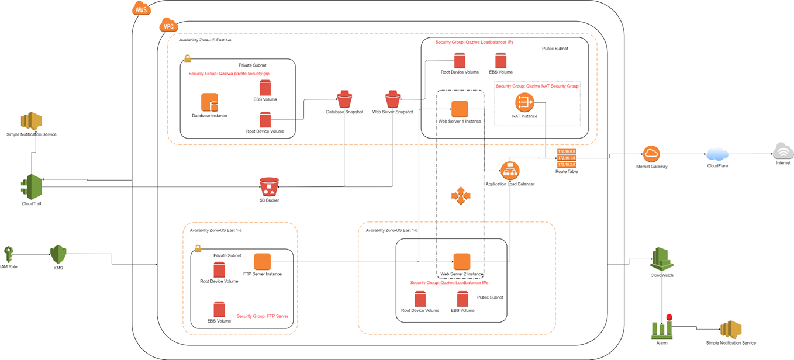

# Project-AWS-C300

Project-AWS-C300 is a project module which helps students to equipped their skills that they have learn throughout the semester and year within the course. This project also showcase our teamwork, critical thinking and solving a real-world problem. In this process of this project, skills such as project management, gather andorganize data, preparing technical reports and presentation pitch will be adapt and put to use.

## Overview:

The project is about implementing security features inside the cloud infrastructure. A website and database are built from scratch before hosting on the cloud. Security testing is conducted to identify the vulnerabilities on the web and database server before mitigating security features. Some enhancements made include website codes with special security parameters, within the database and having security inside the cloud infrastructure using AWS Educate service. 2-factor authentication is also used to ensure changing of sessions constantly to prevent unauthorised access. After implementation, a monitoring system is also created to find abnormalities in the system for better troubleshooting purposes. With all criteria fulfilled, the project will ensure secure website browsing among users (website is HTTPS based using Cloudflare) based on the security features implemented. The final status of the project has been marked as completed and all of the security and AWS Cloud services are being used.

## Introduction:

Our project is called Qaziwa Project. It is a project which involves the Implementation of Security Infrastructure on the Cloud which aims to host a website onto the internet using AWS Educate account and implement some security features to ensure that the website and other services are secure. 

Nowadays many companies have adapted infrastructure to the cloud to ensure the flexibility and the ease to deploy services onto the cloud to meet the agility of the business. The problem we want to solve is that many companies are still using physical servers that are hosted on site and this can cause a big amount of investment on the hardware, need a space or/and room to implement the servers on site, and may be susceptible to data loss during disaster situations such as earthquakes. As such cloud implementation is needed to resolve these types of situations. Like any other on-site server, cloud servers also need to implement some security features to ensure that to prevent attackers from attacking and exfiltrating the data from the cloud.

We are required to design and deploy cloud infrastructure to achieve similarities to the traditional 3 tier web application (Web Tier & Database Tier) using AWS cloud. Auto-scaling and other security features are important in this deployment and development.
  

## Project Specification / Requirements

Deploy a Virtual Private Cloud (VPC); ✔️
Design and deploy a 2 tiers architecture on Cloud (Web-App Tier and DB Tier); ✔️
Web-App tier uses apache web server and PHP application while Database tier uses MySQL. Use XAMPP software for the various tiers. ✔️
Encrypt data in transit (using HTTPS) and data at rest; ✔️
Set up the necessary security groups and IAM groups/users/roles; ✔️
Deploy auto-scaling for Web-App tier; ✔️
Develop a simple web service where read and write to the database are applicable; ✔️
Backup and restoration of MySQL database using manual snapshot for Elastic Block Store (EBS); Store the EBS snapshot on AWS Simple Storage Service (S3).✔️
Use AWS CloudTrail to monitor activities in the VPC. ✔️

## AWS Architecture Diagram

## System Design (Use Case Diagram)

- 3 Users (Registered User, Admin, Guest)
- Admin has the most access
- Only admin can delete, add and edit books
- Guest has the least access
- A guest user can become a registered user

